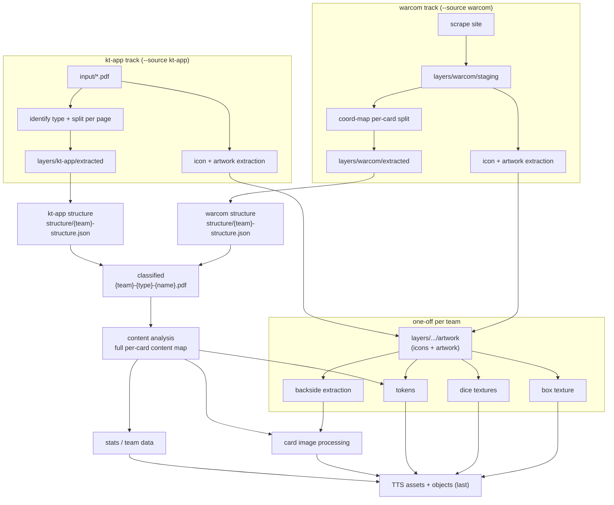

# 01 — Flow

End-to-end stages. The `--source` param decides only the **track-specific** front-end; everything
from **classified** onward is shared.

## Stages

### 1. Extraction front-end — TRACK-SPECIFIC (`--source`)
Different by necessity (single-page PDFs vs scraped multi-card pages). **Two scripts run on the
raw source** (`input/*.pdf` for kt-app, `layers/warcom/staging` for warcom):

1. **Icon + artwork extraction** — see stage 1b; writes to the shared artwork layer.
2. **Card split** — into per-card PDFs:
   - **kt-app**: `input/*.pdf` → **identify type + split per page in one step** → `layers/kt-app/extracted`.
     - _Change from current:_ **drop the `processed` stage** — go straight into `extracted`.
   - **warcom**: scrape site → `layers/warcom/staging` → coordinate-map per-card split → `layers/warcom/extracted`.

> First cut may simply **reuse the existing** `layers/{track}/extracted/` produced by today's
> step scripts, and port the extraction code into `integrated/` later. (Open question.)

### 1b. Icon + artwork extraction — from the RAW source → shared artwork layer
Runs directly on the raw source (**not** on structure/extracted), once per track. Both tracks write
the **same** shared **artwork layer** (`layers/.../artwork`: icons + artwork). This layer is a
distinct block — the downstream one-off assets (backside, dice, box, tokens) **reference the layer**,
not the extraction script.

### 2. Structure — SPLIT PER TRACK
Each track scans **its own** `extracted/` and writes its **own** structure manifest. They stay
separate because the two extraction layouts differ (file naming, page/card ordering).

- Output: `structure/{team}-structure.json` (renamed from the current kt-app `{team}/structure.json`).
- Describes each card: `name`, `type`, `front`/`back` presence, and **card-group** membership
  (multi-card rules, e.g. "CARD X/Y").
- warcom currently writes **no** structure manifest — this gives it one in the shared format.

### 3. Shared lanes — parallel
The card lane and the one-off asset lane run **at the same time**. Both produce identical shared
outputs regardless of `--source`.

**3a. Card lane**
- **Classified**: copy + **rename** extracted PDFs into one shared folder, one PDF per card.
  - Output: `layers/.../classified/{team}-{type}-{name}.pdf` — **no `-front`/`-back` postfix**.
  - e.g. `angels-of-death-datacard-assault-intercessor-grenadier.pdf`,
    `angels-of-death-equipment-auspex.pdf`.
  - Both tracks emit the identical file set — this is the dedup/merge point.
- **Content analysis**: build the **full content map per card** — the same idea as today's
  `layers/kt-app/classified/{team}/structure.json` but richer/complete (statlines, weapons,
  abilities, actions, rules…). One shared per-team manifest every downstream step reads.

**3b. Asset lane — one-off per team (consumes the artwork layer)**
Grouped together because they're all team-level assets generated once per team. All read from the
**artwork layer** (stage 1b):
- **Backside extraction**: produces card backsides from the artwork layer.
  - (An earlier copy landed in the wrong path; that is being removed. Backsides are **not**
    stored in the classified folder.)
- **Tokens**: extract token cutouts. Needs the **content map** (to know which card / token-guide
  to read) **and** the **artwork layer** (for the token-bag image).
- **Dice textures** and **box texture**: derived from the artwork layer. **Only needed for TTS.**

### 4. Downstream — SHARED, with ordering
All write to `output_acc/{team}/...`. **TTS is always last** (depends on every other asset).

- **Card image processing** (PDF → JPEG, compose with backside) — needs **content map + backsides**.
- **Stats / team data** — from the content map.
- **TTS assets + objects** — run **last**; consume cards, stats, tokens, dice, box texture.
  Use kt-app's stat-embedding step 7 as basis.

## Open items raised by earlier rounds
- Front-end: reuse existing `extracted/` now vs port extraction immediately.
- Canonical type vocabulary + hyphen/singular casing for `{type}` (e.g. `datacard`, `equipment`,
  `faction-rule`, `strategy-ploy`, `firefight-ploy`, `operatives-selection`, `token-guide`).
- Source conflict (both tracks ran a team): last-run-wins vs keep both & explicit pick.
- Where icon/artwork extraction reads from: the per-track `extracted/` (preferred, source-agnostic
  shared output) vs the original source PDFs (today's 2a reads the raw multi-page source).
